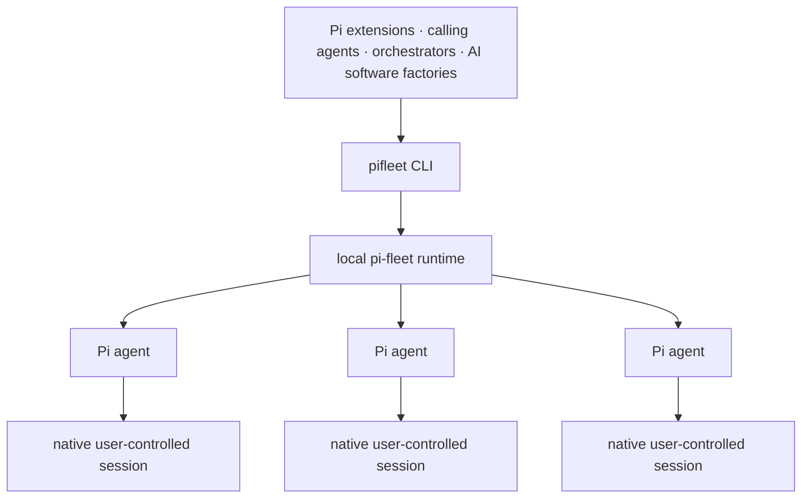

# pi-fleet

**Pi orchestration beyond terminal scale.**

pi-fleet is a local, machine-first runtime for software that orchestrates Pi agents and their native sessions. It provides precise lifecycle control, exact latest-response retrieval, and native structured session data without scraping terminals.

**Control execution. Own the session. Build the orchestration above it.**

## Why pi-fleet exists

A terminal pane is useful observability for one Pi agent. It is not an observability model for dozens or hundreds of them.

Terminal multiplexers such as tmux, cmux, and Herdr expose processes, panes, and rendered output. Agent software needs Pi-aware state: whether an agent is working or idle, whether input was accepted, which native session it is using, what its exact latest settled assistant response was, and whether interrupted work can be retried safely.

| Terminal multiplexers (tmux, cmux, Herdr)  | pi-fleet                                   |
| ------------------------------------------ | ------------------------------------------ |
| Human-facing panes                         | Machine-readable lifecycle control         |
| Rendered stdout and scrollback             | Native Pi session JSONL                    |
| Last _n_ terminal lines                    | Exact latest settled assistant response    |
| Generic terminal input                     | Pi-native prompt and steering semantics    |
| Caller-defined recovery                    | Explicit restoration and failure state     |
| Human attention as the observability layer | Data for custom observability and analysis |

pi-fleet is specialized for Pi. It gives up bundled terminal UX in exchange for semantic control and data that higher-level systems can reliably consume.

## Infrastructure for orchestration



pi-fleet is infrastructure **for orchestration**, not an orchestration framework. It owns execution lifecycle, process availability, ordered communication, restoration references, exact result retrieval, and explicit failure state.

Callers own roles, task decomposition, scheduling, semantic retries, approval, aggregation, dashboards, notifications, knowledge mining, and autonomy.

Typical callers include:

- an existing agent delegating through the [pi-fleet operator skill](./SKILL.md);
- a Pi extension coordinating specialized agents;
- a local service collecting exact results from many Pi agents;
- an AI software factory implementing its own scheduling and quality gates;
- observability, audit, or knowledge systems consuming native Pi sessions.

If your primary requirement is watching one or two agents in terminal panes, a terminal multiplexer such as tmux, cmux, or Herdr will probably fit better. pi-fleet is for builders ready to move control and observability into software.

## Installation

pi-fleet currently supports Linux x64 with Node.js `^22.19.0 || ^24.0.0`.

```bash
npm install --global @elpapi42/pi-fleet@beta
pifleet --version
```

Configure normal Pi provider credentials before the first operational command. pi-fleet commands start or reuse a persistent runtime, so environment variables added only to later invocations do not change that runtime's environment. Use normal Pi credential configuration or configure the persistent runtime/service environment.

## Programmatic quick start

```bash
# Create an agent with the stable programmatic address "reviewer".
pifleet create reviewer --cwd "$PWD" > created.json

# Submit work. While Pi is active, later sends use Pi steering semantics.
pifleet send reviewer "Review the authentication changes" > accepted.json

# Inspect the agent without restoring an absent Pi process.
pifleet status reviewer > status.json

# Wait for idle and retrieve the exact latest assistant response.
pifleet receive reviewer --timeout 10m > result.json

# Feed newly appended native session records to your own tooling.
pifleet watch reviewer > live-session.jsonl
```

Finite commands emit one compact JSON object on stdout. Expected failures emit one structured JSON error object on stderr. Exit status `0` means success, `1` means error, and receive timeout uses `124`. `watch` reserves stdout exclusively for native Pi session JSONL.

`--human` exists as a debugging convenience for the six finite commands; programmatic callers should use the default JSON output.

## Your sessions are the data layer

**pi-fleet controls execution. You control the session.**

`create` creates an agent: a durable logical resource with a stable local name, a native Pi session, and a managed process lifecycle. Its Pi process may be resident or absent, but the agent remains addressable until `destroy`.

The agent's session is not opaque pi-fleet data. It remains a native, user-controlled resource that can support independent observability, auditing, provenance, search, evaluation, and knowledge mining.

- Use Pi's normal session storage or provide exact paths, IDs, directories, forks, and continuation selectors.
- pi-fleet records the concrete session selected by Pi only so it can restore and observe execution.
- pi-fleet never copies, relocates, normalizes, wraps, or deletes session files.
- `destroy` removes pi-fleet management and its process; it never removes the Pi session.
- External tools may read or analyze the same session without a pi-fleet-specific data format.
- Deliberate concurrent writers remain under user control, but they can invalidate restoration and live-tailing guarantees. pi-fleet fails visibly rather than silently taking ownership or substituting a copy.

Pass compatible native Pi selectors after the first literal `--`:

```bash
# Existing session file
pifleet create reviewer --cwd /workspace/project -- --session /absolute/session.jsonl

# Exact Pi session ID
pifleet create reviewer -- --session-id SESSION_ID

# Native first-launch selection
pifleet create reviewer -- --fork /absolute/source.jsonl
pifleet create reviewer -- --continue
```

`--cwd` is a pi-fleet option and belongs before `--`. Native Pi options belong after it and preserve their token order:

```bash
pifleet create reviewer \
  --cwd /workspace/project \
  -- \
  --session /absolute/session.jsonl \
  --model anthropic/claude-sonnet-4 \
  --thinking high
```

Headless `--resume` is unsupported because it requires interactive selection before RPC mode. Positional Pi prompts and `@file` inputs after `--` are rejected; use optional create instructions or `send` so pi-fleet can preserve ordered delivery.

## Pi-aware control primitives

```text
pifleet create NAME [INITIAL_INSTRUCTIONS] [--cwd PATH] [--human] [-- PI_OPTIONS...]
pifleet send NAME MESSAGE [--human]
pifleet receive NAME [--timeout DURATION] [--human]
pifleet status NAME [--human]
pifleet list [--human]
pifleet watch NAME
pifleet destroy NAME [--human]
```

| Purpose                | Commands         | Semantics                                                                 |
| ---------------------- | ---------------- | ------------------------------------------------------------------------- |
| Create an agent        | `create`         | Assign a stable local name and start Pi, optionally with initial input    |
| Communicate            | `send`           | Start ordinary work while idle or steer active work at Pi's next decision |
| Retrieve exact results | `receive`        | Wait for idle and return Pi's latest assistant text                       |
| Inspect lifecycle      | `status`, `list` | Observe logical and process state without restoring Pi                    |
| Observe session data   | `watch`          | Stream newly appended native session JSONL records                        |
| Release execution      | `destroy`        | Stop pi-fleet management without deleting the Pi session                  |

Every agent has a local name of 1–63 lowercase letters, digits, or interior hyphens. The name is its stable programmatic address—not a persona, role, or second source of truth.

### Send and receive

A successful `send` means pi-fleet accepted and ordered the input. It does not mean work completed or guarantee a distinct response. Repeated sends may steer the same active run.

`receive` waits for Pi to become idle and returns the exact latest assistant text known to pi-fleet. It is non-consuming and intentionally not correlated one-to-one with a particular send. This is semantic result retrieval, not terminal scrollback.

`--timeout 0` polls immediately. Use explicit durations such as `30s`, `5m`, or `1h`; unitless values are milliseconds. Timeout never cancels Pi work, and canceling a held receive affects only that client.

Use explicit stdin for large or shell-sensitive input. pi-fleet never consumes piped stdin implicitly. Input must be valid, nonempty UTF-8 and is limited to 512 KiB by default.

```bash
git diff | pifleet send reviewer -
pifleet create researcher - --cwd "$PWD" < instructions.md
```

### Lifecycle and recovery

An idle agent's Pi process normally remains resident. If the process is absent, a later `send` restores the agent from its concrete native session when safe. `status`, `list`, `watch`, and retrieval of an already settled response do not restore the process.

Inspect failed state before deciding what the orchestrator should do:

- `runtime_interrupted` means active work stopped and was not silently replayed.
- `delivery_uncertain` means Pi may have received the input; replay could duplicate tool side effects.
- `incarnation_cleanup_uncertain` means pi-fleet cannot prove an old process writer is gone.
- `session_unavailable` or `session_ambiguous` means continuity cannot safely be claimed.

A new explicit send is new work, not evidence that uncertain earlier work did nothing. Semantic retry policy belongs to the calling orchestrator.

### Native session stream

`watch` is a live, byte-faithful tail of complete LF-terminated records from the persistent Pi session JSONL. It emits no pi-fleet wrappers, lifecycle records, history, or transient RPC events, and it never wakes or steers Pi.

For an existing file, `watch` starts at the current EOF. For an unmaterialized session, it waits and begins at byte zero when the file appears. Detectable replacement, truncation, lag, path changes, or runtime loss fail visibly on stderr instead of being guessed or replayed.

Lifecycle and status are available through pi-fleet's finite JSON commands. `watch` is the native session-data surface; it is not terminal output and not a public stream of raw transient Pi RPC traffic.

## Runtime, data, and maintenance

The short-lived CLI connects to one private per-user runtime. On first operational use, pi-fleet verifies and materializes an immutable runtime release, then starts it in the background. A registered native service is preferred when present; service management remains experimental and outside the seven-command beta interface.

Linux defaults:

```text
pi-fleet state:  ~/.local/state/pi-fleet/
Materialized:    ~/.local/share/pi-fleet/releases/
Runtime socket:  $XDG_RUNTIME_DIR/pifleet-$UID/control.sock
                 (or the system temporary directory without XDG_RUNTIME_DIR)
Pi sessions:     Pi's normal ~/.pi storage or the exact selected path
```

`PIFLEET_STATE_ROOT` and `PIFLEET_APPLICATION_ROOT` override pi-fleet-owned locations. A CLI whose state root differs from an installed service fails with repair guidance rather than connecting to the wrong database.

`npx @elpapi42/pi-fleet@beta` is suitable for evaluation; global installation is recommended for continued use. pi-fleet materializes its runtime independently of the npm cache or installation, so evaluation can leave runtime and state behind.

Before uninstalling, destroy agents you no longer want pi-fleet to manage:

```bash
pifleet list
pifleet destroy NAME
npm uninstall --global @elpapi42/pi-fleet
```

Removing the npm package does not delete Pi sessions, pi-fleet SQLite state, materialized releases, or an already-running runtime/service. Reinstalling a compatible version reconnects to preserved state. There is no automatic self-update, telemetry, remote transport, or npm `postinstall` service registration. Database migrations are forward-only; reinstalling an older binary is not database rollback.

## Beta status

Beta.9 has passed deterministic Linux x64 fault, recovery, package, compatibility, systemd/PID-1 restart, and resource-stability tests with Pi `0.80.10`. Its tag workflow verifies the exact registry artifact, provenance, and a fresh global-install operational smoke.

Known limits:

- Linux x64 is the only validated support target. Arbitrarily hoisted local-prefix, pnpm, and unusual `npx` dependency layouts are unsupported.
- Disposable systemd/PID-1 restart and user-lingering recovery are validated; a full host logout and kernel reboot are not.
- macOS launchd and descendant containment, real disk exhaustion, and multi-hour resource growth remain unvalidated.
- Runtime upgrades are not automatic, and active runtimes are not silently replaced.
- Session tails cannot promise exactly-once delivery under arbitrary external mutation.
- A promptless missing session path can remain unmaterialized until Pi writes conversation content, following native Pi behavior.
- Managed Pi `0.80.10` pins `brace-expansion@5.0.6`, affected by local glob-input denial-of-service advisory `GHSA-3jxr-9vmj-r5cp`. Beta.9 permits only that exact package/version/path/advisory in the production-audit gate; every additional or changed production vulnerability fails release. Tracking: [earendil-works/pi#6882](https://github.com/earendil-works/pi/issues/6882).

For support, include `node --version`, `pifleet --version`, `pifleet list`, and `pifleet status NAME`. Never include API keys, message contents, session contents, or private paths unnecessarily. Report reproducible issues at <https://github.com/elpapi42/pi-fleet/issues>.

## Development

```bash
npm ci
npm run audit:production
npm run typecheck
npm run lint
npm run format:check
npm test
npm run test:faults
npm run build
npm run test:package
npm run test:platform
npm run test:soak
```

## License

MIT © elpapi42
